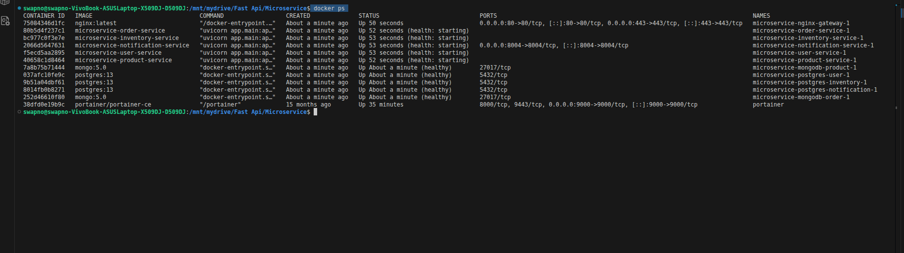
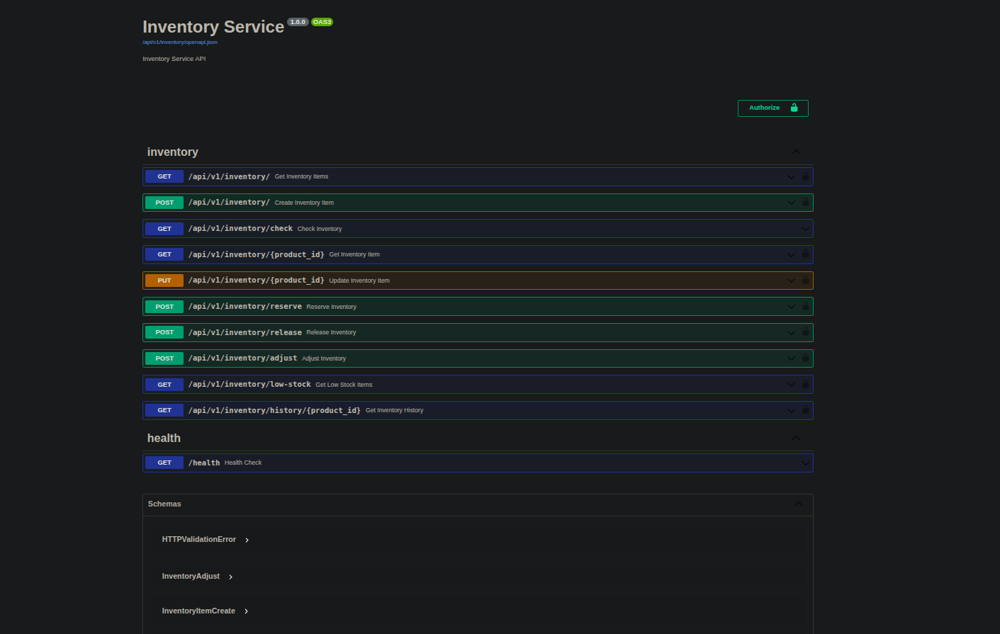
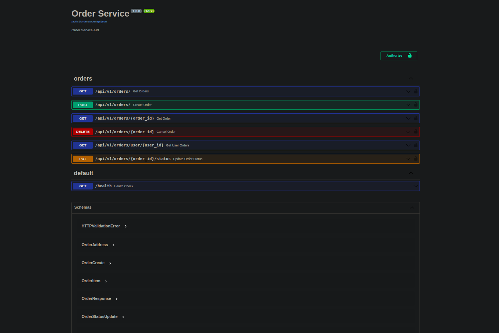

# Microservice Application

This is a full-stack microservice-based application built using:

- **Frontend**: React.js / Next.js(Pending)
- **Backend**: FastAPI (Ongoing)
- **Databases**: PostgreSQL and MongoDB
- **Containerization**: Docker (multi-stage Dockerfiles)

## System Architecture


## Project Structure
- **User Service**: Handles authentication, registration, and user management.
- **Inventory Service**: Manages stock levels, warehouses, and inventory operations.
- **Product Service**: Maintains product data, categories, and pricing.
- *(Upcoming)* **Payment Service**: Will manage transactions, payment gateways, and order settlements.

Each microservice is containerized using a **multi-stage Dockerfile** for optimized production builds.
Each service have it's own docker-compose.yml to run servicess independently for testing/development.
## Features

- Authentication and Authorization
- RESTful APIs (FastAPI, Django REST Framework)
- PostgreSQL and MongoDB as backend databases
- Modern frontend with React.js and Next.js
- Dockerized with multi-stage builds
- Scalable and modular microservice architecture

## Docker Setup

### Prerequisites

- Docker
- Docker Compose

### Running the app

```bash
# Clone the repo
git clone https://github.com/Swapno963/Microservice-with-FastAPI.git
cd Microservice-with-FastAPI

# Build and start all services
docker-compose up --build
```



# User Microservice

A dedicated microservice for managing all user-related functionality. This service handles user authentication, profile management, and account security.
postgres is used as database.


### Features

This microservice includes the following key functionalities:

* **Registration:** New user account creation.
* **Login:** User authentication to grant access.
* **Token Management:** Ability to get a new access token using a refresh token.
* **User Profile:** Retrieve and update user profile information.
* **Password Management:** Securely change user passwords.
* **Address Management:** Create and manage user addresses.
* **Account Verification:** Verify if a user account already exists.


# Product Microservice

A microservice for managing all product-related functionality. This service handles product creation, update.
Mongodb is used as database.
### Features

This microservice includes the following key functionalities:

* **Products:** Get all the products
* **product:** Create Product
* **Product<id>:** See Detail/Update/Delete product
* **Category:** Get category list.


# Inventory Microservice

This handel inventory-related functionality. This service handles Create Inventory, Check Inventory, Update inventory and keeping inventory history, Reserve inventory quantiry and keeping history of it,Relese inventory quantiry and keeping history of it,Check low stock and send mail.
Postgres is used as database.


* **Create inventory:** Create, update inventory for a product, get inventory items
* **reserve:** Reserve inventory of a specific product
* **release:** release inventory of a specific product
* **adjust:** Add/Remove inventory of a specific product
* **low-stockst:** Returns all the products whose available_quantity is low compare to reorderd_threshold
* **history:** Get history of a specific product




# Order Microservice

A microservice for managing all Order-related functionality. This service handles product order,get all oraders, update order, cancle order.
Mongodb is used as database.


### Features

This microservice includes the following key functionalities:

* **orders:** Check inventory availability for all the products. Reserve inventory for all the products. Create the order in the pending status
* **orders:**     Get all orders with optional filtering. This endpoint allows filtering by:
    - Order status
    - User ID
    - Date range
* **orders<order_id>:** Get a single order by ID.
* **/user/{user_id}:** Get all orders for a specific user.
* **/{order_id}/status:**     Update the status of an order. This will validate the status transition and update inventory as needed.
* **/{order_id}:**  Cancel an order (if not shipped). This will set the order status to cancelled and release inventory.





