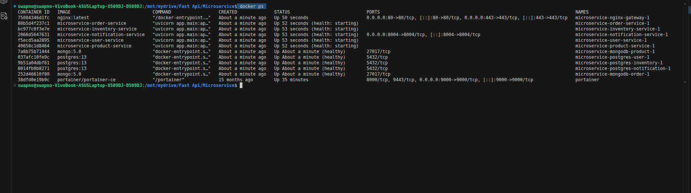
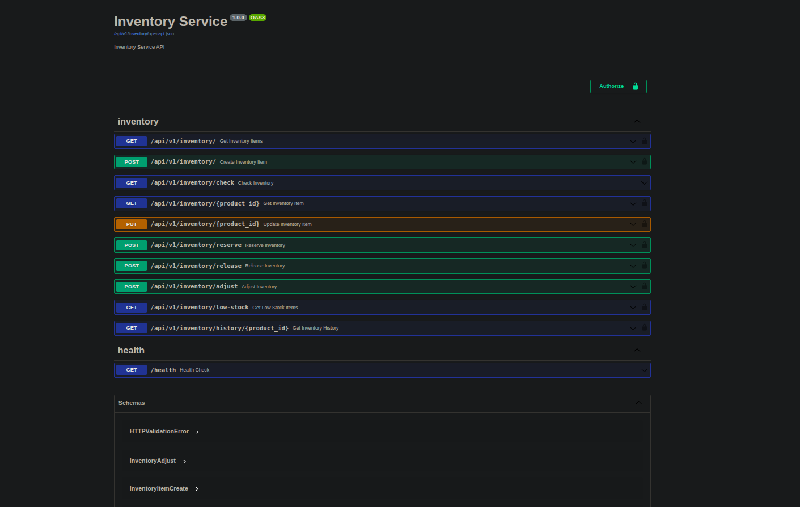
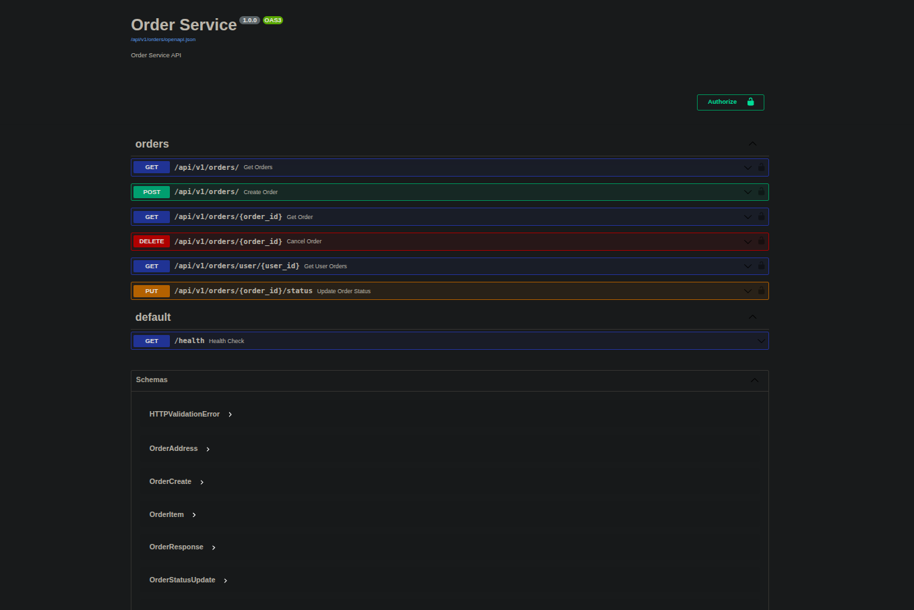

# Microservice Application

This is a full-stack microservice-based application built using:

- **Frontend**: React.js / Next.js(Pending)
- **Backend**: FastAPI (Ongoing)
- **Databases**: PostgreSQL and MongoDB
- **Containerization**: Docker (multi-stage Dockerfiles)

## System Architecture


## Project Structure
- **User Service**: Handles authentication, registration, and user management.
- **Inventory Service**: Manages stock levels, warehouses, and inventory operations.
- **Product Service**: Maintains product data, categories, and pricing.
- *(Upcoming)* **Payment Service**: Will manage transactions, payment gateways, and order settlements.

Each microservice is containerized using a **multi-stage Dockerfile** for optimized production builds.
Each service have it's own docker-compose.yml to run servicess independently for testing/development.
## Features

- Authentication and Authorization
- RESTful APIs (FastAPI, Django REST Framework)
- PostgreSQL and MongoDB as backend databases
- Modern frontend with React.js and Next.js
- Dockerized with multi-stage builds
- Scalable and modular microservice architecture

## Docker Setup

### Prerequisites

- Docker
- Docker Compose

### Running the app

```bash
# Clone the repo
git clone https://github.com/Swapno963/Microservice-with-FastAPI.git
cd Microservice-with-FastAPI

# Build and start all services
docker-compose up --build
```



# User Microservice

A dedicated microservice for managing all user-related functionality. This service handles user authentication, profile management, and account security.
postgres is used as database.


### Features

This microservice includes the following key functionalities:

* **Registration:** New user account creation.
* **Login:** User authentication to grant access.
* **Token Management:** Ability to get a new access token using a refresh token.
* **User Profile:** Retrieve and update user profile information.
* **Password Management:** Securely change user passwords.
* **Address Management:** Create and manage user addresses.
* **Account Verification:** Verify if a user account already exists.


# Product Microservice

A microservice for managing all product-related functionality. This service handles product creation, update.
Mongodb is used as database.
### Features

This microservice includes the following key functionalities:

* **Products:** Get all the products
* **product:** Create Product
* **Product<id>:** See Detail/Update/Delete product
* **Category:** Get category list.


# Inventory Microservice

This handel inventory-related functionality. This service handles Create Inventory, Check Inventory, Update inventory and keeping inventory history, Reserve inventory quantiry and keeping history of it,Relese inventory quantiry and keeping history of it,Check low stock and send mail.
Postgres is used as database.


* **Create inventory:** Create, update inventory for a product, get inventory items
* **reserve:** Reserve inventory of a specific product
* **release:** release inventory of a specific product
* **adjust:** Add/Remove inventory of a specific product
* **low-stockst:** Returns all the products whose available_quantity is low compare to reorderd_threshold
* **history:** Get history of a specific product




# Order Microservice

A microservice for managing all Order-related functionality. This service handles product order,get all oraders, update order, cancle order.
Mongodb is used as database.


### Features

This microservice includes the following key functionalities:

* **orders:** Check inventory availability for all the products. Reserve inventory for all the products. Create the order in the pending status
* **orders:**     Get all orders with optional filtering. This endpoint allows filtering by:
    - Order status
    - User ID
    - Date range
* **orders<order_id>:** Get a single order by ID.
* **/user/{user_id}:** Get all orders for a specific user.
* **/{order_id}/status:**     Update the status of an order. This will validate the status transition and update inventory as needed.
* **/{order_id}:**  Cancel an order (if not shipped). This will set the order status to cancelled and release inventory.





### Upcomeing
This platform evolves from a single-vendor e-commerce system into a multi-vendor SaaS solution, where:

Small business owners (vendors) can register and manage their own stores
Customers can browse and purchase from multiple vendors
The platform earns revenue via subscription or per-user/per-request pricing


2. Core Actors
2.1 Admin (Platform Owner)
Manages the entire system
Controls vendors, pricing, and policies
2.2 Vendor (Business Owner)
Registers to sell products
Manages store, inventory, and orders
2.3 Customer
Browses products
Places orders
Interacts with vendors
3. SaaS Business Model
Pricing Options (Configurable)
Subscription-based (monthly/yearly)
Per-user pricing (vendor team members)
Per-transaction fee
Freemium (limited features)
4. Feature Breakdown
4.1 Authentication & Authorization
Features
User registration (Customer / Vendor)
Login / Logout
Role-based access control (RBAC)
Email verification
Password reset
Advanced (Production-level)
OAuth (Google, Facebook)
Multi-factor authentication (MFA)
4.2 Vendor Management
Features
Vendor onboarding
Business name
Contact details
Store metadata
Vendor dashboard
Vendor approval workflow (manual/auto)
Advanced
Vendor tier system (Basic / Pro / Enterprise)
Store customization (logo, theme)
4.3 Product Management
Features
Create / Update / Delete products
Product categories
Product variants (size, color, etc.)
Inventory management
Pricing and discount setup
Advanced
Bulk upload (CSV)
AI-assisted product description
Multi-warehouse inventory
4.4 Marketplace (Customer Side)
Features
Product browsing
Search and filtering
Product details page
Add to cart
Wishlist
Advanced
Personalized recommendations
Recently viewed products
Multi-vendor cart handling
4.5 Order Management
Features
Place order
Multi-vendor order splitting
Order tracking
Order history
Vendor Side
Accept / Reject orders
Update order status
Advanced
Partial fulfillment
Returns and refunds
4.6 Payment System
Features
Payment gateway integration
Order payment processing
Advanced
Vendor payout system
Commission handling
Wallet system
4.7 Subscription & Billing (SaaS Core)
Features
Vendor subscription plans
Billing cycle management
Usage tracking
Advanced
Pay-per-request billing
Auto invoice generation
Payment failure handling
4.8 Reviews & Ratings
Features
Product reviews
Vendor ratings
Advanced
Review moderation
Fraud detection
4.9 Notifications
Features
Email notifications
Order updates
Advanced
SMS / Push notifications
Event-driven notifications
4.10 Admin Panel
Features
Vendor management
Product moderation
Order monitoring
Revenue tracking
Advanced
Analytics dashboard
Fraud detection tools
5. Non-Functional Requirements
5.1 Scalability
Support multiple vendors and high traffic
Horizontal scaling
5.2 Performance
Fast product search
Optimized DB queries
5.3 Security
Data isolation between vendors (multi-tenancy)
Secure payments
Rate limiting
5.4 Reliability
Fault-tolerant services
Backup and recovery
6. Architecture Considerations
MVP (Junior mindset)
Monolith application
Shared database
Simple role-based filtering
Production-grade (Senior mindset)

A senior engineer thinks:

“This is not just e-commerce, this is a multi-tenant SaaS system.”

So they design for:

Tenant isolation (logical or physical)
Microservices (optional evolution)
Event-driven architecture (orders, payments)
Read-heavy optimization (caching, search engine like Elasticsearch)
7. Multi-Tenancy Strategy
Option 1: Shared Database (Row-level isolation)
vendor_id in every table
Option 2: Schema per Vendor
Better isolation
More complex
Option 3: Database per Vendor
Maximum isolation
High operational cost
8. Future Enhancements
AI product recommendation
Vendor analytics dashboard
Affiliate marketing system
Internationalization (multi-language, currency)
Mobile app support
9. DevOps & Deployment Considerations
Junior View
“Deploy app with Docker”
Senior View
CI/CD pipelines
Blue-green deployments
Observability (logs, metrics, tracing)
Rate limiting & API gateway
Database migration strategy
10. Risks & Challenges
Multi-vendor cart complexity
Payment split & vendor payout
Data isolation bugs (critical)
Scaling search and filtering
Vendor misuse / fraud
11. MVP Scope (Recommended First Release)

To avoid over-engineering:

Vendor registration
Product management
Basic marketplace
Single payment flow
Simple subscription plan